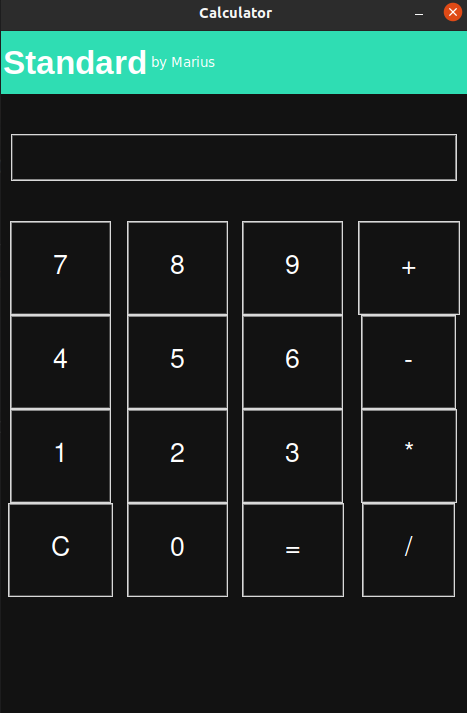

<h1>Standard Calculator using  Tkinter GUI in Python</h1>
 
<h2>Features</h2>
<ul>
    <li>Numbers</li>
    <li>Addition</li>
    <li>Substraction</li>
    <li>Multiplication</li>
    <li>Division</li>
    <li>Result</li>
    <li>Reset result</li>
</ul>

<h2>Acknowledgments</h2>

<b> Python3: http://bit.ly/python3-certifications <b>
 

<h2>Photo</h2>

 

<h2>Contact</h2>

<b> Email: mariusc0023@gmail.com </b>
